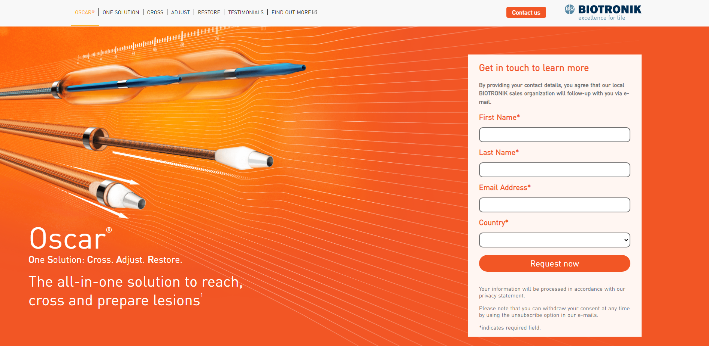

# Oscar - Biotronik

> [LIVE DEMO](https://biotronik-landing.netlify.app/)




## Build Setup

```bash
# install yarn
$ npm install yarn

# install dependencies
$ yarn

# serve with hot reload at localhost:3000
$ yarn dev

# build for production and launch server
$ yarn build
$ yarn start

# generate static project
$ yarn generate
```
